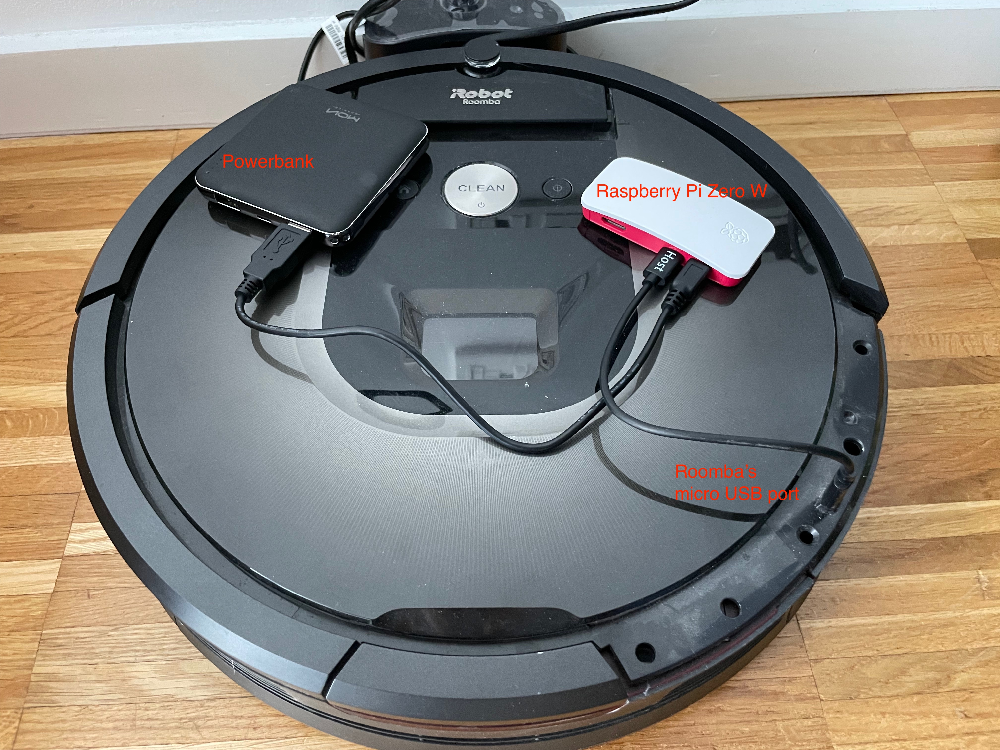

# Roomba with PS4 Controller

With this small project you can control your Roomba with a Playstation 4 controller and play Midi songs.

## Installation
```bash
git clone https://github.com/danielzuegner/roomba_control.git
cd roomba_control
pip install -r requirements.txt
```
## Setup
* Check whether your Roomba has a micro USB port. I have a Roomba 960 and the USB port is located under a section of the chassis on the bottom right. See the image below for details:

* Connect a computer with the USB port I've used a Raspberry Pi Zero W with a powerbank, but other options should work.
* Clone this repo on the computer you want to use to control your Roomba
* Connect the computer to your PS4 controller, e.g., as described [here](https://salamwaddah.com/blog/connecting-ps4-controller-to-raspberry-pi-via-bluetooth).
* Figure out the device interface of the USB connection to your Roomba. For my Raspberry Pi, the port is `/dev/ttyACM0`.
* Figure out the device interface of the Bluetooth connection to your PS4 controller. In my case, this is `/dev/input/js0`.

## Usage
Once your setup is complete, simply run 
```bash
python roomba.py --interface /your/roomba/interface --controller-interface /your/ps4/interface
``` 
and have fun! Steering is straightforward with the L3 analog stick. Vaccuuming can be turned on with R2. I've added a couple of songs to play on the square, x, circle, triangle, up arrow, and down arrow buttons.

## Convert MIDI to Roomba Songs
If you want to teach your Roomba more songs, you can use `midi_to_roomba.py` to do so:
```bash
python midi_to_roomba.py --file your_midi_file.mid --track TRACK_ID
```
where `TRACK_ID` is the ID of the MIDI track you would like to export. 

 Simply add the output JSON into the `SONGS_DICT` in [`songs.py`](songs.py).